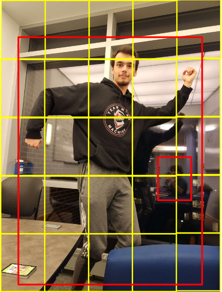
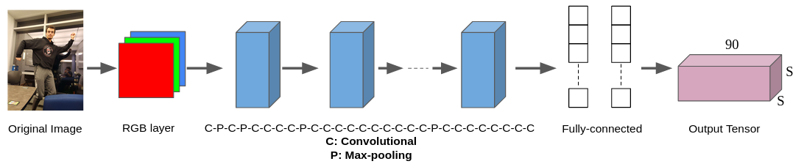

  

### Authors: Dokyun Kim & [Dominic Salmieri](https://github.com/joloujo)
 

# Introduction
Using OpenCV and a Neato, we will recreate the **Red Light Green Light** game from the Netflix show *Squid Game*. The Neato will periodically rotate towards the players, and whoever is still moving gets eliminated from the game.

# Methodology
This program uses 2 popular computer vision algorithms in its main functionality. YOLO (You Only Look Once) is used for person detection, and SORT (Simple Online Realtime Tracking) is used for tracking unique people throughout the game. A more detailed explanation of each algorithm will be provided in the following sections.

## YOLO (You Only Look Once)

Unlike other detection methods such as HOG (Histogram of Gradients), RCNN, or CNN, YOLO significantly outperforms them in speed. YOLO v1, released in 2016, processed 45 frames per second on a Titan X GPU. YOLO locates and classifies an object at the same time in a one-step process, hence the name 'You Only Look Once.'

The description below is based on the structure of YOLO v1. This program uses the latest YOLO v8, but the governing concepts behind them are similar.

YOLO divides a given image into a S x S grid, represented with the yellow lines in the image below. The red boxes are objects identified by the algorithm. 

  

*Img 1: YOLO example*

Each grid cell is represented as a multidimensional vector. The first 5 values are $[x_1,y_1,w_1,h_1,c_1]$, where $(x_1,y_1), w_1, h_1$ are the position, width, and height of the bounding box, and $c_1$ is the confidence level (0~1). The next 5 values are $[x_2,y_2,w_2,h_2,c_2]$, as each grid cell can handle up to 2 bounding boxes. The remaining values are $[p_1...p_80]$ where each value represents what object the box belongs to in the train dataset. This example uses the COCO dataset, which has 80 objects. For example, if the 3rd object in the dataset was a person, the values would look like $[0,0,1,....0]$. The final output of the neural network ends up being a S x S x 90 tensor.

Compared to neural networks of RCNN-type algorithms, YOLO's neural network is much simpler. As shown below, YOLO's neural network consists of 24 convolutional layers, 4 max-pooling layers, and 2 fully-connected layers. 

  

*Img 2: YOLO's neural network structure*

## Simple Online Real-time Tracking (SORT)

# Works Cited

Bewley, Alex, et al. "Simple online and realtime tracking." 2016 IEEE international conference on image processing (ICIP). IEEE, 2016. 

Oh, Il-Seok. Pattern Recognition, Computer Vision, and Machine Learning. Hanbit Academy, 2023.  

Redmon, Joseph, et al. "You only look once: Unified, real-time object detection." Proceedings of the IEEE conference on computer vision and pattern recognition. 2016.
