

  

### Authors: Dokyun Kim & [Dominic Salmieri](https://github.com/joloujo)
 

# Introduction
Using OpenCV and a Neato, we will recreate the **Red Light Green Light** game from the Netflix show *Squid Game*. The Neato will periodically rotate towards the players, and whoever is still moving gets eliminated from the game.

# Methodology
This program uses 2 popular computer vision algorithms (YOLO and SORT) to track people's movement.

Tracking algorithms usually consist of 4 main steps. 
1. Identification
2. Extract features
3. Calculate distance
4. Match pairs

**Step 1** is done using YOLO (You Only Look Once) while **steps 2, 3 and 4** will be done using SORT (Simple Online Realtime Tracking). 
An explanation of each algorithm will be provided in the sections below.

## Using YOLO (You Only Look Once)

Unlike other detection methods such as HOG (Histogram of Gradients), RCNN, or CNN, YOLO significantly outperforms them in speed. YOLO v1, released in 2016, processed 45 frames per second on a Titan X GPU. YOLO locates and classifies an object at the same time in a one-step process, hence the name 'You Only Look Once.'

The description below is based on the structure of YOLO v1. This program uses the latest YOLO v8, but the governing concepts behind them are similar.

YOLO divides a given image into a S x S grid, represented with the yellow lines in the image below. The red boxes are objects identified by the algorithm. 

  

*Fig 1: YOLO example*

Each grid cell is represented as a multidimensional vector. The first 5 values are $[x_1,y_1,w_1,h_1,c_1]$, where $(x_1,y_1), w_1, h_1$ are the position, width, and height of the bounding box, and $c_1$ is the confidence level (0~1). The next 5 values are $[x_2,y_2,w_2,h_2,c_2]$, as each grid cell can handle up to 2 bounding boxes. The remaining values are $[p_1...p_80]$ where each value represents what object the box belongs to in the train dataset. This example uses the COCO dataset, which has 80 objects. For example, if the 3rd object in the dataset was a person, the values would look like $[0,0,1,....0]$. The final output of the neural network ends up being a S x S x 90 tensor.

Compared to neural networks of RCNN-type algorithms, YOLO's neural network is much simpler. As shown below, YOLO's neural network consists of 24 convolutional layers, 4 max-pooling layers, and 2 fully-connected layers. 

  

*Fig 2: YOLO's neural network structure*

## Using SORT (Simple Online Realtime Tracking)

<!-- SORT INTRODUCTION -->

Let $B_{detection}$ represent all the bounding boxes containing people that are identified by YOLO. During the feature extraction process, SORT uses the target's size and past movement from time $t-1$ (equation 1). $(x,y)$ is the target's center, $s$ is size, $r$ is the height to width ratio (fixed). $\dot{x}, \dot{y}, \dot{s}$ represent the previous movement performed by the target. SORT then uses this information to predict the target's location at time $t$. The predictions are stored in $B_{prediction}$.

$b=(x,y,s,r, \dot{x}, \dot{y}, \dot{s})$ *Equation 1*

Then, the IOU (Intersection Over Union) of $B_{detection}$ and $B_{prediction}$ is calculated and converted to distance by subtracting it from 1. These distances are then stored in a matrix. If the number of boxes in $B_{detection}$ and $B_{prediction}$ are different, placeholder boxes are added to the smaller set to ensure both matrices are square. The placeholder boxes have a large distance value to prevent matching with real boxes. A distance matrix example is shown below.

  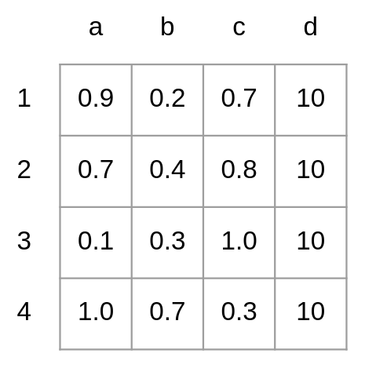

*Fig 3: Example distance matrix calculated using* $B_{detection} = [1,2,3,4]$ *and* $B_{predicted} = [a,b,c]$. *A placeholder box* $d$ *has been added to* $B_{predicted}$ *to form a square matrix.*

With the distance matrix, SORT now applies the [Hungarian Algorithm](https://en.wikipedia.org/wiki/Hungarian_algorithm) to find the best-matching pairs. The Hungarian Algorithm is an optimization algorithm that assigns 'tasks' to 'workers' to minimize the 'cost.' For example, when assigning tasks (a-c) to workers (1-3) given the cost matrix below (Fig 4), the pairs 1-c, 2-a, 3-b would minimize the cost.

  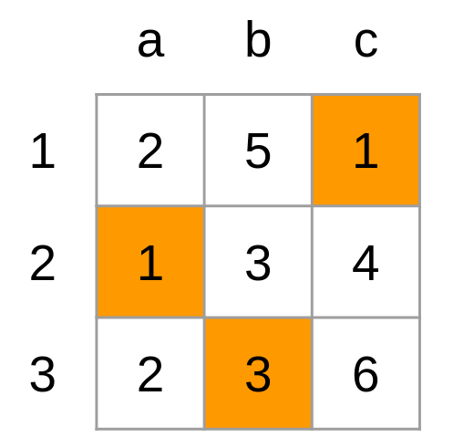

*Fig 4: Example of the Hungarian Algorithm, the highlighted cells represent the pairings that minimize the cost.*

With this in mind, finding best-matching pairs using the distance matrix (Fig 3) becomes an optimization problem for assigning boxes from $B_{predicted}$ (task) to $B_{detected}$ (workers) to minimize the distances (cost).

  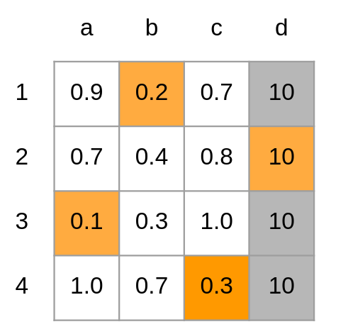

*Fig 5: Result of applying the Hungarian Algorithm to the distance matrix. The best-matching pairs are 1-b, 2-d, 3-a, and 4-c. Since column d was added for the sake of making the matrix square, the 2-d pairing gets thrown out.*

Once SORT finishes all the steps described above, it moves onto the next frame after postprocessing. During postprocessing, the $b$ values (equation 1) of each target in $B_{predicted}$ gets updated depending on if they have been matched. For targets with a match, their $x,y,s,r$ is replaced with those of their matching pairs, and their $\dot{x}, \dot{y}, \dot{s}$ is updated using a [Kalman Filter](https://en.wikipedia.org/wiki/Kalman_filter). For targets without a match, their $x,y,s$ is updated by adding $\dot{x}, \dot{y}, \dot{s}$. For boxes in $B_{detected}$ without a match, they are considered new objects and their *b* values are initialized with $\dot{x}=0, \dot{y}=0, \dot{s}=0$. The new boxes are added to $B_{predicted}$.

<!-- IMAGE FROM ACTUAL PROGRAM WITH BBOX IDS HERE -->

## Image Substraction

Identifying people and tracking their bounding boxes works well to detect some movement, but if a player moves within their bounding box, the size and shape of the bounding box may not change. To pick up these in-bounding box movements, we used an image difference algorithm to calculate how much the pixels in each bounding box changed between two sequential frames of the video.

To start, the absolute difference between two images is found:

  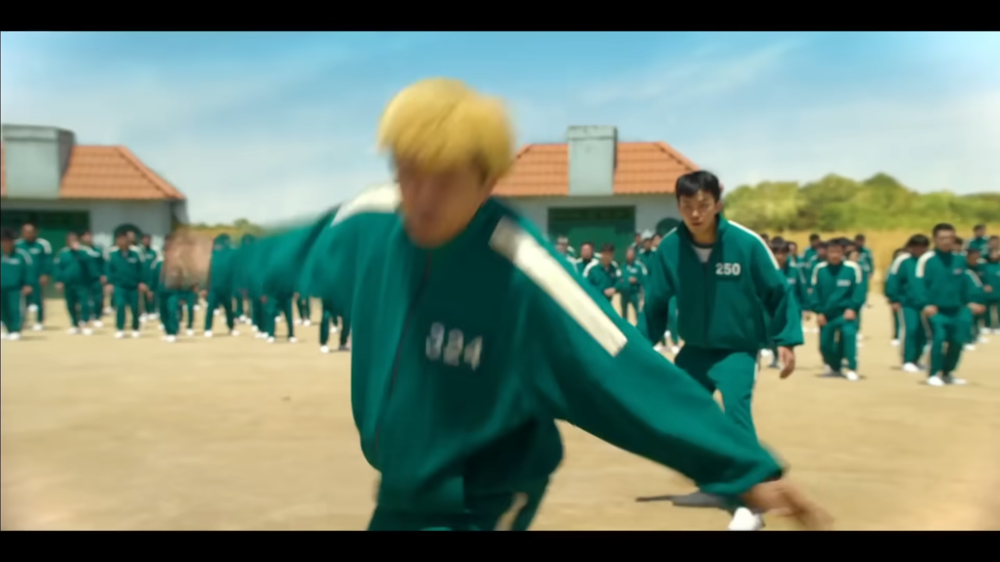
  +
  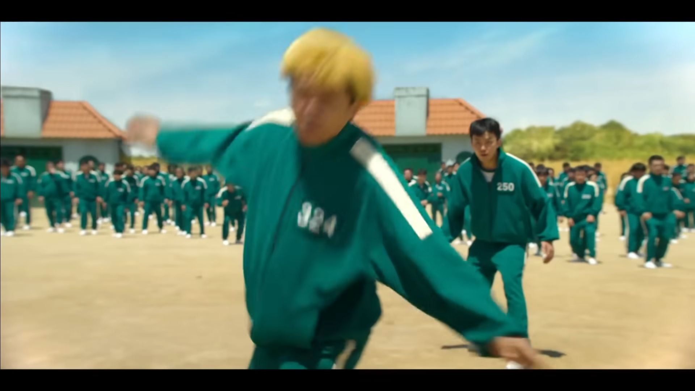
  ->
  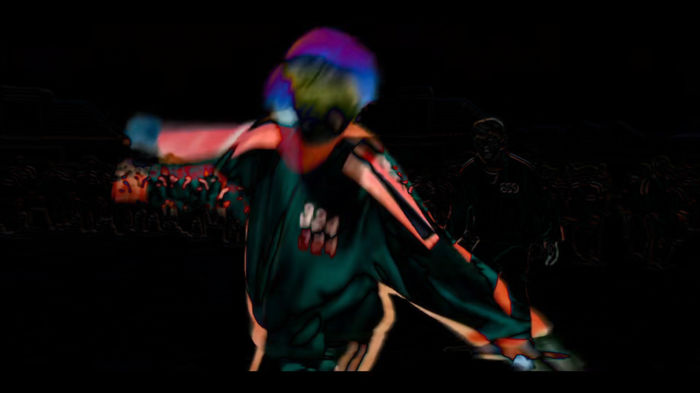

*Fig 6: The `cv.absdiff()` between two consecutive frames of video*

Then, the image is converted to grayscale if it isn't already. The reason this is done after the difference opperation is that it captures more of the difference. 

  
  ->
  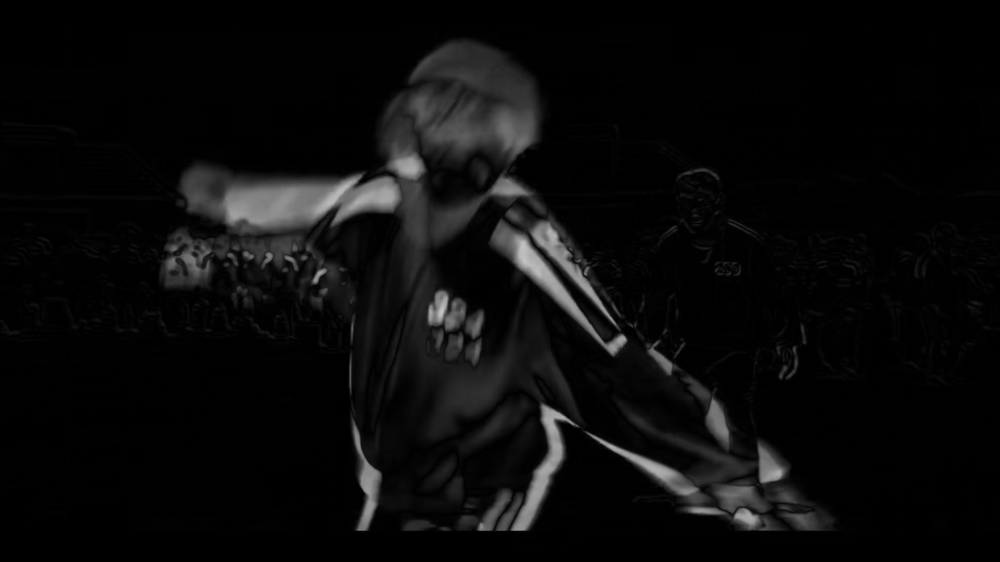

*Fig 7: The `cv.cvtColor(_, cv.COLOR_BGR2GRAY)` of the difference of the frames*

Once the image is grayscale, it is threshholded, making it a binary image composed of white pixels that changed and black pixels that did not. 

  
  ->
  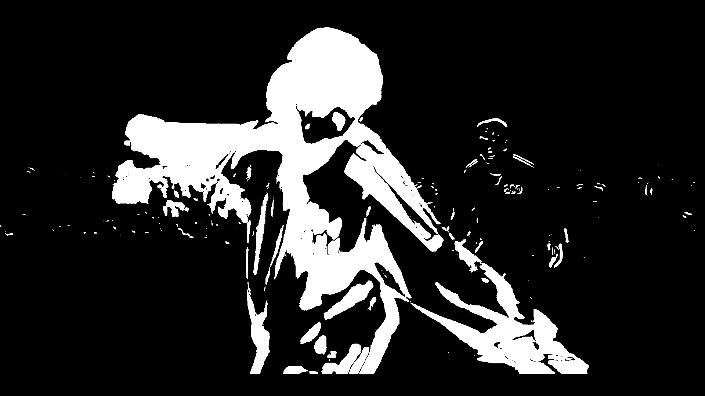

*Fig 8: The `cv.threshold(_, threshold, 255, cv.THRESH_BINARY)` of the grayscale difference using the given threshhold*

Finally, the image is opened to remove noise, which is an errosion followed by a dilation. This operation will remove small differences that are likely noise without significantly affecting the area of larger differences.    

  
  ->
  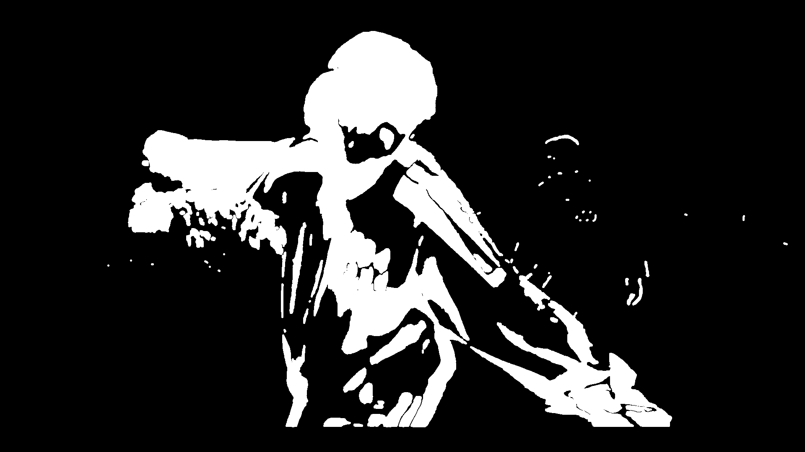

*Fig 9: The `cv.morphologyEx(_, cv.MORPH_OPEN, kernel)` of the threshholded difference using the given kernel*

Once we have the final difference, we find the amount of changed pixels in each player's bounding box. If this sum is greater than a certain number, then the player is considered to have moved.

# Adding Game Features [(neato_integration branch)](https://github.com/dokyun-kim4/neato_game/tree/neato-integration)

In a real game of Red Light Green Light, there is one "traffic cop" who turns towards the players in random time intervals. When a player is caught moving while the traffic cop is facing the players, they are eliminated from the game. If a player manages to tap the traffic cop's shoulders without getting eliminated, game is finished.

## State Machine
A [Neato](https://neatorobotics.com/collections/robot-vacuums) will be the traffic cop for this project, rotating towards/away from players periodically and searching for movement. Shown below is a state diagram for various states the Neato will be in throughout the game.

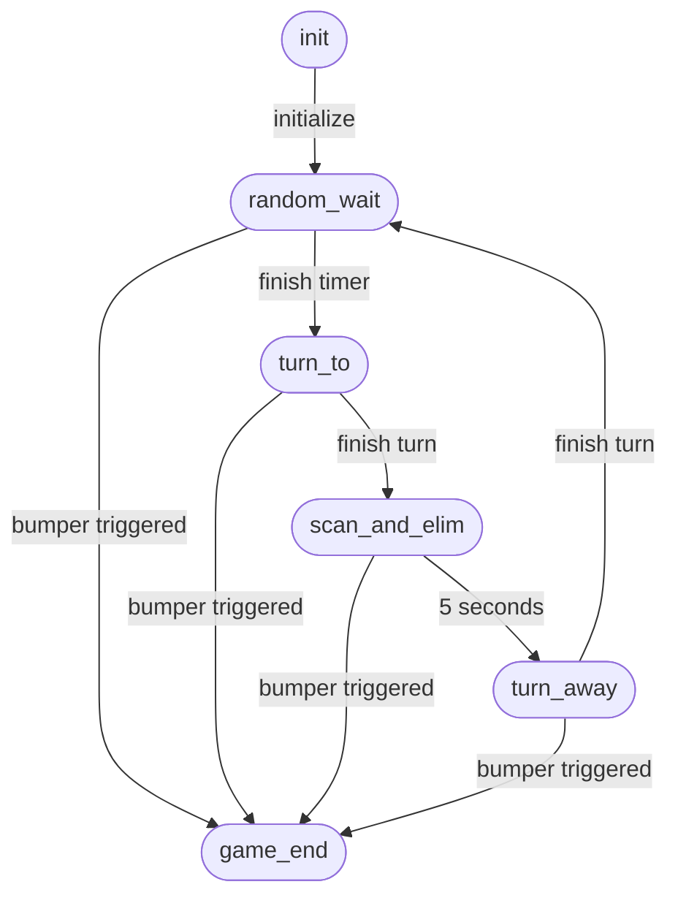
*Fig 10: State Diagram of Neato*

- `random_wait` state is when the Neato is waiting for a randomly selected time period before turning towards the players.   
- `turn_to` state is when the Neato is turning towards the players.  
- `scan_and_elim` is when the Neato is scanning for movement and elimininating moving players.  
- `turn_away` is when the Neato's scanning period (5 seconds) has passed and is turning away from the players.
- `game_end` can be entered at any point in the loop when the Neato's bump switch is triggered. This represents the shoulder tapping, indicating that the game is over.

## Nodes
To integrate key game features into the Neato, various topics need to be published and subscribed to. In our case, there are 2 subscriber nodes and 1 publisher node.

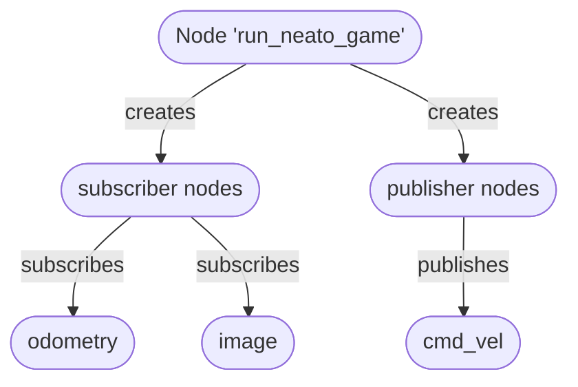
*Fig 11: Node Diagram*

The `odometry` subscriber ensures the Neato is turning the correct amount every iteration. The `image` subcriber collects frames that are used for movement detection. The `cmd_vel` publisher ensures that the Neato turns at a desired angular velocity.

<!-- DEMO HERE? -->

# Works Cited

Bewley, Alex, et al. "Simple online and realtime tracking." 2016 IEEE international conference on image processing (ICIP). IEEE, 2016. 

Oh, Il-Seok. Pattern Recognition, Computer Vision, and Machine Learning. Hanbit Academy, 2023.  

Redmon, Joseph, et al. "You only look once: Unified, real-time object detection." Proceedings of the IEEE conference on computer vision and pattern recognition. 2016.
